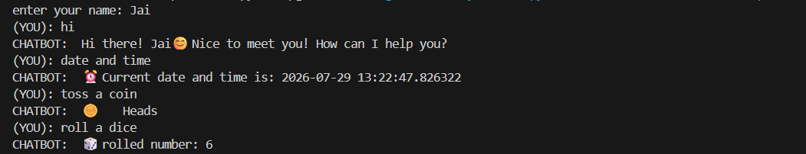
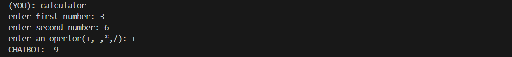

# 🤖 RuleBot - Rule-Based Chatbot using Python

## 📌 Project Overview

**RuleBot** is a simple rule-based chatbot developed using **Python**. It interacts with users by recognizing predefined commands and responding with appropriate answers. The chatbot also includes fun utilities such as a calculator, dice roll, coin toss, date & time display, and a Rock-Paper-Scissors game.

This project demonstrates the use of **conditional statements, functions, loops, modules, and user interaction** in Python.

---

## ✨ Features

* 👋 Greets the user with a personalized welcome message
* 😊 Responds to common conversational questions
* 🤖 Introduces itself
* 📅 Displays the current date and time
* 🪙 Tosses a coin 
* 🎲 Rolls a dice 
* 🎮 Plays Rock-Paper-Scissors
* 🧮 Performs basic arithmetic calculations
* 🙏 Responds politely to thanks and goodbye messages
* ❓ Provides a help menu showing available commands

---

## 🛠️ Technologies Used

* **Python 3**
* **random** module
* **datetime** module

---

## 📂 Project Structure

```text
Task1_Rulebased_chatbot/
│
├── chatbot.py                  # Main chatbot program
├── README.md                   # Project documentation
├── .gitignore                  # Git ignored files
├── requirements.txt
└── screenshots/
    ├── Calculator.png          # Calculator feature
    ├── Conversation.png        # Chat conversation
    ├── Exit message.png        # Goodbye message
    └── Help menu.png           # Help menu
```

---

## ⚙️ How It Works

1. The chatbot asks the user to enter their name.
2. It waits for the user's message.
3. The input is converted to lowercase using `.lower()`.
4. The chatbot matches the input with predefined commands using `if-elif-else`.
5. It generates the appropriate response or performs the requested action.
6. Random responses are generated using the `random` module whenever required.
7. The conversation continues until the user types **bye** or **exit**.

---

## 💬 Sample Commands

You can try the following commands:

* hello
* hi
* good morning
* how are you
* what is your name
* tell something about yourself
* what can you do
* date and time
* toss a coin
* roll a dice
* play rock paper scissors
* calculator
* help
* thanks
* bye
* exit

---

# 📸 Screenshots

### 💬 Conversation



---

### 🧮 Calculator



---

### ❓ Help Menu


---

### 👋 Exit Message


---

## 🔮 Future Improvements

* Add a GUI using Tkinter.
* Improve the chatbot with Natural Language Processing (NLP).
* Store conversation history.
* Support more commands and intelligent responses.
* Integrate speech recognition and text-to-speech.

---

## 👩‍💻 Author

**Mansi Sharma**

This project is a part of CodSoft AI internship


