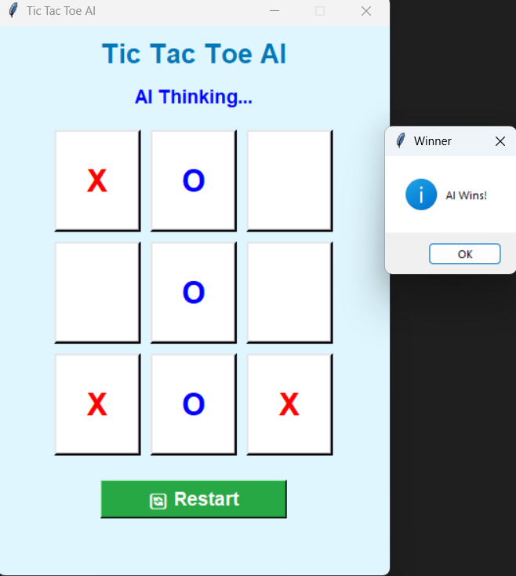

# 🎮 AI Tic-Tac-Toe using Minimax Algorithm

An intelligent **Tic-Tac-Toe** game developed using **Python** and **Tkinter**, where the player competes against an AI powered by the **Minimax Algorithm**.

The AI analyzes all possible game states and always chooses the optimal move, making it impossible to defeat. This project demonstrates the implementation of **Artificial Intelligence**, **Game Theory**, **Recursion**, and **GUI development** using Python.

---

# ✨ Features

- 🤖 AI opponent powered by the Minimax Algorithm
- 🎮 Interactive graphical user interface using Tkinter
- ❌ Human plays as **X**
- ⭕ AI plays as **O**
- 🧠 Intelligent move selection for optimal gameplay
- 🏆 Automatic winner detection
- 🤝 Draw detection
- 🚫 Prevents invalid moves
- 🔄 Restart button to play multiple games
- 💻 Simple and user-friendly interface

---

# 🛠️ Technologies Used

- Python 3
- Tkinter
- Minimax Algorithm
- Recursion

---

# 📂 Project Structure

```text
Task2_TicTacToe_AI/
│
├── tic_tac_toe.py            # Main game source code
├── README.md                 # Project documentation
├── .gitignore                # Git ignored files
├── requirements.txt
└── screenshots/
    ├── Game start.png
    ├── First move.png
    ├── Game draw.png
    └── Winner.png
```

---

# ⚙️ How It Works

1. The player starts the game as **X**.
2. The AI plays as **O**.
3. After each player move, the AI uses the **Minimax Algorithm** to evaluate all possible future game states.
4. The AI selects the move with the highest score, ensuring optimal gameplay.
5. The game continuously checks for a winner or draw after every move.
6. If a player wins or the board is full, the game displays the result.
7. The **Restart** button resets the board for a new game.

---

# 📸 Screenshots

## 🎮 Game Start


---

## ❌ First Move


---

## 🤝 Game Draw


---

## 🏆 Winner




---

# 🔮 Future Enhancements

- 🌟 Add multiple difficulty levels (Easy, Medium, Hard)
- 🎨 Improve UI with animations
- 👥 Add Player vs Player mode
- 📊 Scoreboard to track wins and draws
- ⏱️ Add move timer

---

# 👩‍💻 Author

### Mansi Sharma

This project is a part of CodSoft AI internship.
